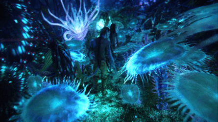
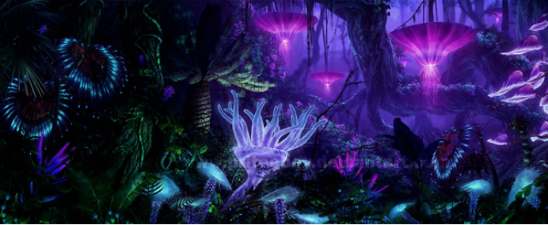
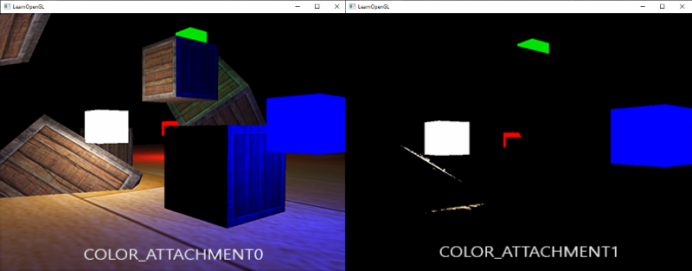

# Repot Quiz8

Part 1: Imaging Technique Inspiration

Imaging technology source: bioluminescence scene in the movie "Avatar".

The nighttime forests of the planet Pandora shown in this film are a magical and beautiful visual spectacle. Its bio-luminescent effect provides a unique way to combine natural elements with fantasy, providing viewers with an immersive viewing experience. I wanted to incorporate this bio-luminescent effect at night into my project as it enhances the atmosphere of the scene and makes the design more attractive.






Part 2: Coding Technique Exploration

Coding technology: OpenGL Shading Language (GLSL)
GLSL is a high-level shading language designed for OpenGL. With this coding technique, every stage of the graphics rendering pipeline can be controlled, enabling complex visual effects such as bioluminescence. GLSL allows direct manipulation of pixel and vertex data, providing powerful tools for implementing custom rendering effects. Fluorescence effects can be simulated and their brightness, color, and intensity controlled to achieve bioluminescent effects similar to those in Avatar.

Vertex shader (usually saved as a .vert file)：

```
#version 330 core

layout(location = 0) in vec3 aPos; 
layout(location = 1) in vec3 aNormal;
layout(location = 2) in vec2 aTexCoords;

out vec3 FragPos;
out vec3 Normal;
out vec2 TexCoords;

uniform mat4 model;
uniform mat4 view;
uniform mat4 projection;

void main()
{
    FragPos = vec3(model * vec4(aPos, 1.0));
    Normal = mat3(transpose(inverse(model))) * aNormal;  
    TexCoords = aTexCoords;
    
    gl_Position = projection * view * vec4(FragPos, 1.0);
}
```


Fragment shader (usually saved as .frag file) to simulate bioluminescence：

```
#version 330 core

out vec4 FragColor;

in vec3 FragPos;
in vec3 Normal;
in vec2 TexCoords;

uniform sampler2D texture_diffuse1;
uniform vec3 lightColor = vec3(1.0, 1.0, 1.0); 
uniform vec3 lightPos = vec3(0.0, 1.0, 2.0); 

void main()
{
    float ambientStrength = 0.1;
    vec3 ambient = ambientStrength * lightColor;
  
    vec3 norm = normalize(Normal);
    vec3 lightDir = normalize(lightPos - FragPos);
    float diff = max(dot(norm, lightDir), 0.0);
    vec3 diffuse = diff * lightColor;
    
    vec3 bioGlow = vec3(0.0, 0.3, 0.7); 
    float glowStrength = 0.5;
    vec3 result = (ambient + diffuse) * vec3(texture(texture_diffuse1, TexCoords)) + glowStrength * bioGlow;

    FragColor = vec4(result, 1.0);
}
```


[Link Text]https://learnopengl.com/Introduction

[Link Text]https://learnopengl.com/Advanced-Lighting/Bloom

